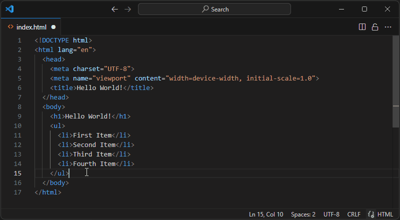
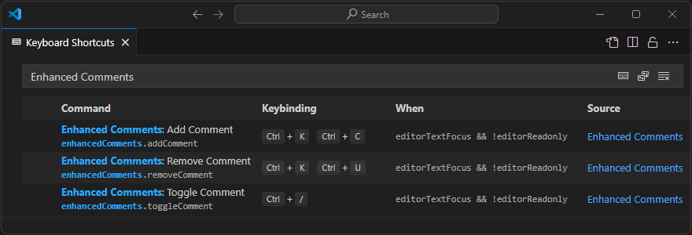

<h1 align="center">
   
    
   
  Enhanced Comments
   
</h1>

This extension enhances the comment functionality of VS Code for HTML, XML and Markdown files. 
* Call the "Add Comment" command on multiple lines and each line will get its own block comment.
* If you add a comment to a line which already has a comment, the opening and closing block will be replaced.
* The "Toggle Comment" command checks if all selected lines are comments and then adds or removes block comments.
* For all other file types the corresponding built-in commands are invoked.

## Configuration

This extension overrides the default keybindings of Add, Remove and Toggle Line Comment. To change the behavior, adjust the following keybindings:

## Known Issues

- Embedded CSS- and JavaScript-Code in HTML is not supported.

## Release Notes

### 1.0.0

Initial release of Enhanced Comments