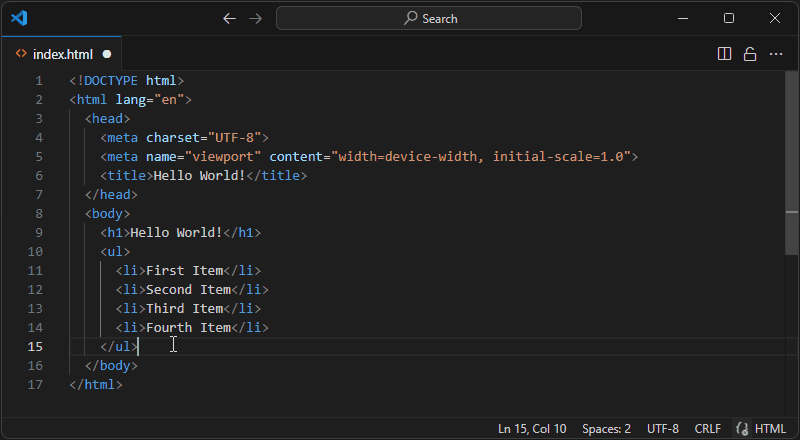
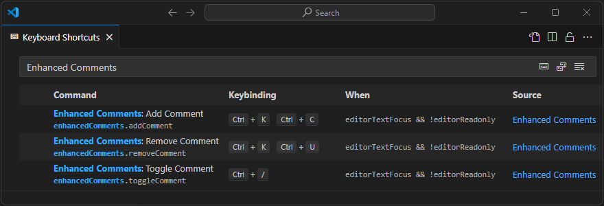
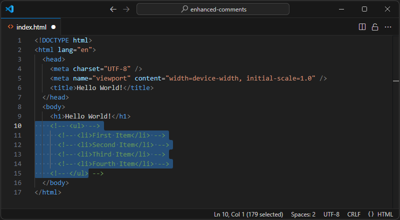
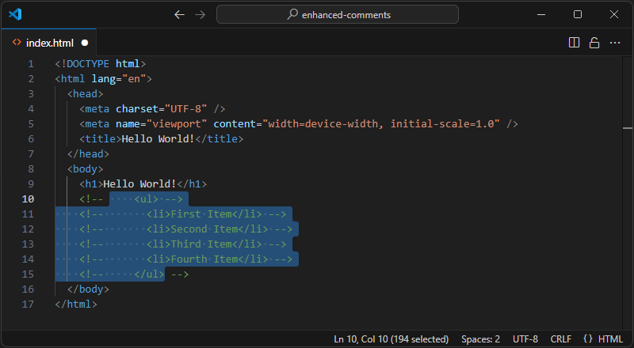
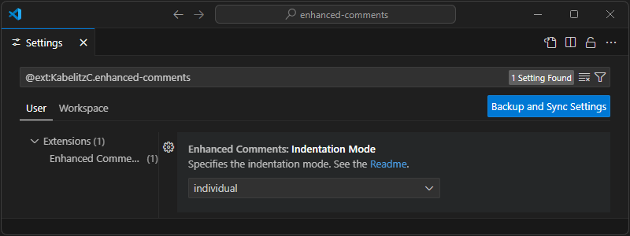

<h1 align="center">
   
    
   
  Enhanced Comments
   
</h1>

  
  
  
  

This extension enhances the comment functionality of VS Code for HTML, XML and Markdown files.

- Call the "Add Comment" command on multiple lines and each line will get its own block comment.
- If you add a comment to a line which already has a comment, the opening and closing block will be replaced.
- The "Toggle Comment" command checks if all selected lines are comments and then adds or removes block comments.
- For all other file types the corresponding built-in commands are invoked.

## Configuration

### Keybindings
This extension overrides the default keybindings of Add, Remove and Toggle Line Comment. To change the behavior, adjust the following keybindings:

### Indentation Mode

There are three different indentation modes:

1. individual: The comment starts at the position where the first non-whitespace charakter is. This is computed for each line individually.  

2. global: The comment starts for each line at the position where the first non-whitespace charakter of the first marked line is.  

3. add indent of first line: The comment starts for each line at the position where the first non-whitespace charakter of the first marked line is. Additionally the indent of the first line is added to every line.  

 You can specifiy it in the settings:  

## Known Issues

- Embedded CSS- and JavaScript-Code in HTML is not supported.
- The global indentation mode does not work properly, if you use whitespaces and tabs for indentation at the same time.

## Release Notes

### 1.1.0

- Added different indentation modes
- Improved blank line detection

### 1.0.0

Initial release of Enhanced Comments
